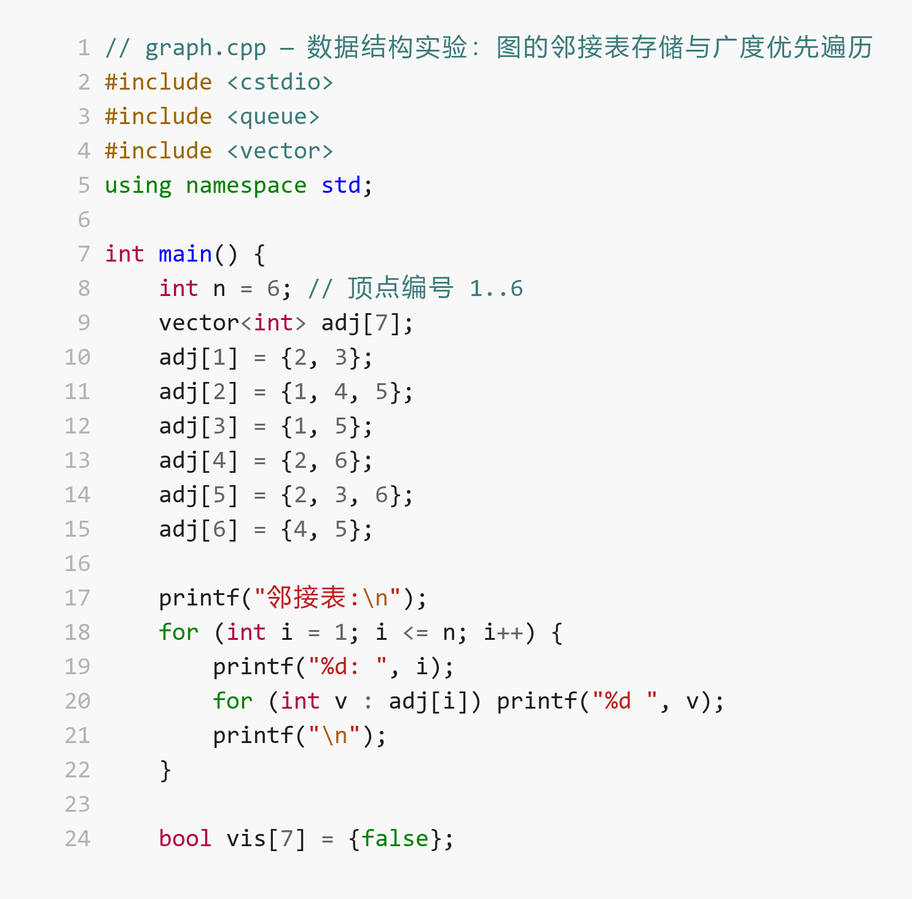
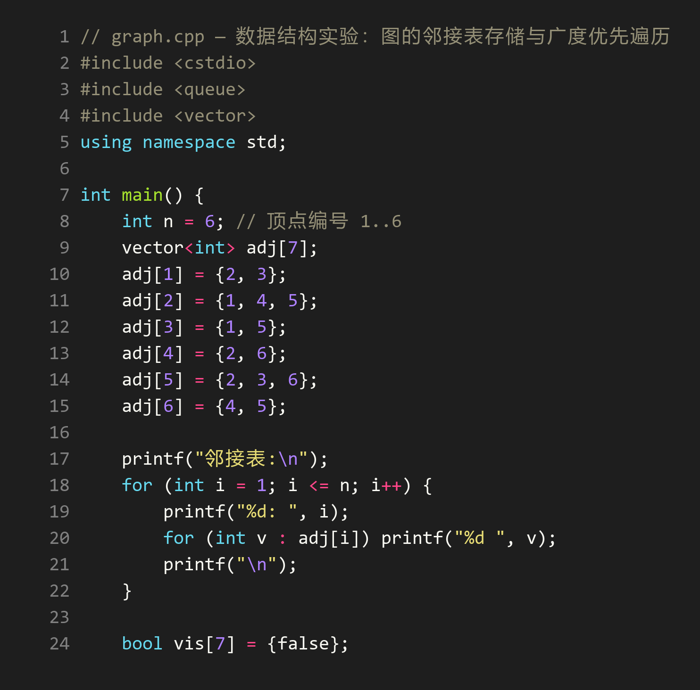
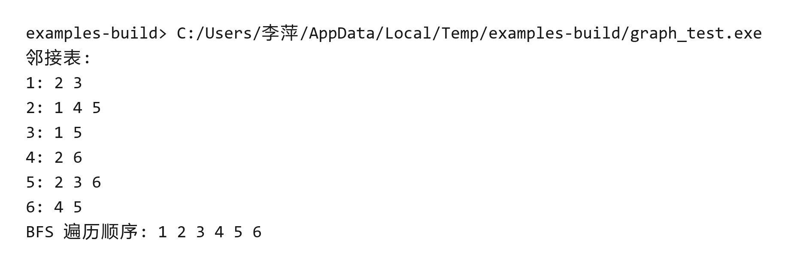

# Computer Lab Report Skill

面向编程、数据结构、算法、数据库、操作系统等计算机课程的实验报告、实训报告、课程设计和大作业报告 Skill。它负责把课程要求、报告模板、源代码和真实运行结果组织成可交付的实验报告，并提供代码截图与终端截图工具。

## 能做什么

- 填充已有 Markdown 或 Word 实验报告模板
- 没有模板时使用内置模板生成报告草稿
- 读取真实代码并基于实际执行结果撰写分析
- 生成带语法高亮的代码截图和终端输出截图
- 在交付前检查未填占位符、截图路径和结果一致性
- 优化实验分析、结果解释、调试复盘和总结的文字质量
- 填写已有 Word 模板时锁定原有格式，只修改目标内容；新建文档时才应用排版规范

> 仓库内置截图工具、DOCX 格式保护器和报告工作流。DOCX 内容编辑仍由宿主环境完成，但编辑前后的格式基线和验证由 `scripts/docx_format_guard.py` 独立执行。

## 效果预览

代码截图（浅色，含中文注释）：



代码截图（深色）：



终端运行截图：



## 目录

```text
SKILL.md                 Skill 触发条件与完整工作流
scripts/code_shot.py     代码截图
scripts/term_shot.py     终端输出截图
scripts/auto_shot.py     自动终端截图（真实捕获失败时回退为真实计算结果的模拟渲染）
scripts/report-shot.py   批量截图
scripts/docx_format_guard.py  DOCX 格式基线与验证
templates/               内置实验报告模板
references/              文字质量正反示例与检查标准
evals/evals.json         核心行为评测用例
```

## 安装依赖

### Windows

```powershell
./setup.ps1
```

### macOS / Linux

```bash
./setup.sh
```

也可以直接安装：

```bash
pip install -r requirements.txt
```

截图使用 Pillow、Pygments、pyte 和 wcwidth；Windows 在 Python 3.9+ 上安装 pywinpty 以使用 ConPTY。缺少 ConPTY 时会明确降级为管道捕获。DOCX 格式保护器只使用 Python 标准库；若需要从 Markdown 转换为 DOCX，可选安装 Pandoc。

## 使用示例

在支持 Skills 的 Agent 环境中，可以直接提出：

> 按这个 Word 模板补全数据结构实验报告。代码在 `src/graph.cpp`，运行命令是 `./graph_test`，需要代码截图和运行截图。

> 我没有模板，请根据 `main.py` 和课程要求生成 Python 实验报告，并导出 DOCX。

> 只帮我生成实验报告要用的代码截图和终端截图，不用写全文。

Skill 会先检查工作区和模板，只在缺少阻塞信息时集中提问，不会编造运行结果或性能数据。

## 截图工具

推荐通过脚本路径调用，不依赖全局 PATH：

```bash
python scripts/code_shot.py -f app.py -l 10-50 -o screenshots/app.png --json
python scripts/term_shot.py -c "python app.py" --cwd . --columns 100 --transcript screenshots/run.txt -o screenshots/run.png --json
python scripts/auto_shot.py -c "build/app.exe" --cwd . -o screenshots/run.png --columns 100 --json
python scripts/report-shot.py report-config.json --json
```

输出目录不存在时脚本会自动创建。终端截图默认优先使用 PTY/ConPTY，保留 ANSI 颜色、回车覆盖、窗口列宽和 stdout/stderr 顺序；JSON 会返回捕获模式、命令退出码、警告和转录路径。批量截图只要有一项失败，`report-shot.py` 就会返回非零退出码，并在 JSON 中标记 `partial` 或 `error`。

查看完整参数：

```bash
python scripts/code_shot.py --help
python scripts/term_shot.py --help
python scripts/auto_shot.py --help
python scripts/report-shot.py --help
```

## 终端截图准确性

`term_shot.py` 不再把输出简单去除 ANSI 后按字符串长度绘制，而是通过 `pyte` 模拟终端状态，并使用 `wcwidth` 计算 Unicode 显示列宽。Windows 自动优先使用 ConPTY，macOS/Linux 使用 PTY；只有无法使用伪终端时才降级为合并管道。

- `--columns` 控制真实换行列宽。
- `--capture-mode auto|pty|pipe` 控制捕获方式。
- `--transcript` 保存处理 ANSI、光标和 `\r` 后的最终可见文本。
- 非零命令仍会保存截图，但工具默认返回非零状态；只有预期失败演示才使用 `--allow-nonzero`。
- JSON 中的 `prompt_synthetic` 表示命令提示符由工具生成，不是交互式 Shell 原始输出。

## DOCX 格式保护

已有 DOCX 必须先建立基线，再验证输出文件：

```bash
python scripts/docx_format_guard.py snapshot original.docx -o format-baseline.json --json
python scripts/docx_format_guard.py verify format-baseline.json output.docx --original original.docx --manifest format-manifest.json --json
```

验证器会检查原文件是否被覆盖、受保护部件是否变化、原有格式节点是否被修改，以及新增格式节点是否来自原文档中的同类格式。验证返回非零退出码时，不得交付 DOCX。

## 内置模板

| 模板 | 文件 | 适用场景 |
|---|---|---|
| 编程语言类 | `templates/programming-experiment.md` | Python、Java、C/C++ 等程序设计实验 |
| 算法/数据结构类 | `templates/algorithm-experiment.md` | 排序、树、图、查找和复杂度分析 |

内置模板是起点，不要求原样保留所有示例小节。Skill 会删除与实际作业无关的模板内容。

## 设计原则

- 先读取代码和课程要求，再写技术内容
- 先运行验证，再描述实验结果
- 有模板时优先保留模板，不覆盖原文件
- 已有 DOCX 的字体、字号、行距、缩进、表格、页面、页眉页脚和样式定义均不可修改
- 编辑已有 DOCX 前后对受保护部件做哈希和格式节点快照对比；出现非预期差异时不得宣称完成
- 不执行危险、提权、联网安装或来源不可信的命令
- 无法验证的信息明确标注，不伪造成功结果
